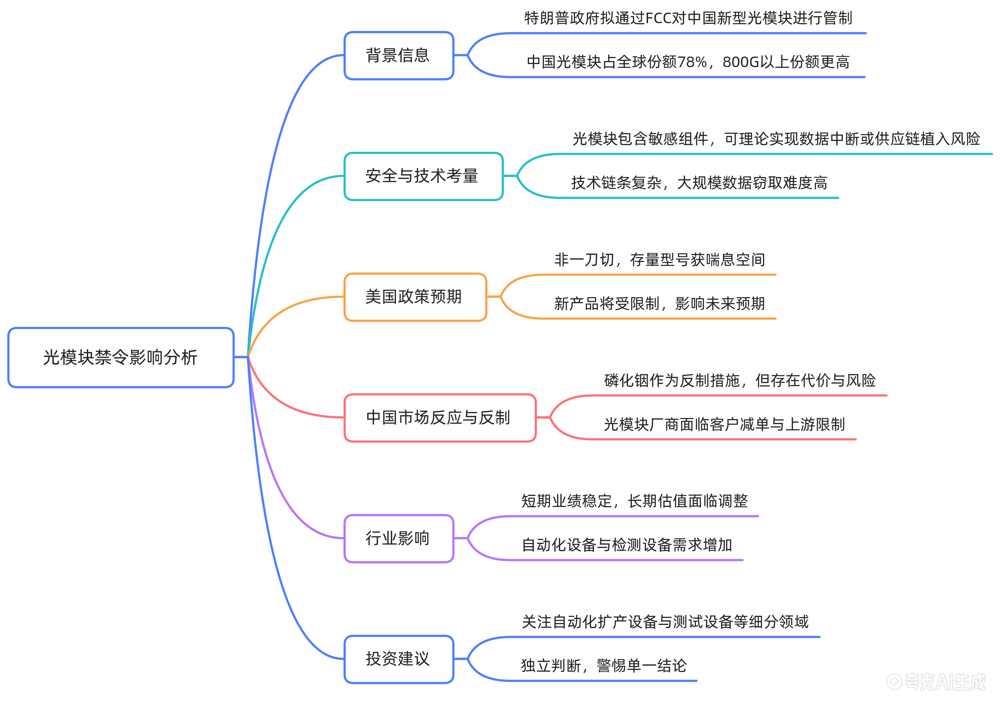

- 本视频讲述了美国 FCC 拟出台光模块禁令对产业链的深层影响。指出禁令虽非一刀切，但将限制中国厂商新技术进入美国市场，压制远期估值。短期业绩因供需缺口仍强劲，但中长期面临自主可控趋势下的格局重塑。建议关注自动化设备、液冷等避险环节，并强调独立理性判断的重要性。

- 事件背景与市场误读 00:00
  - 特朗普政府拟通过 FCC 出台针对中国新型光模块的管制草案，将其视为 AI 基础设施敏感商品。
  - 市场普遍低估该事件影响，简单认为光模块仅进行光电转化，无数据存储功能，安全风险低。
  - 实际上光模块包含 DSP 芯片、固件等，理论上存在中断、误码或供应链植入风险，尽管大规模攻击技术复杂度高且无公开证据，但美方仍有安全担忧。
- 海外建厂规避风险的局限性 01:24
  - 资本市场观点寄希望于海外建厂规避风险，但新规可能穿透原产地标签追溯企业主体和上游供应链。
  - 单纯转移制造地点无法根源化解地缘合规压力，若无法获得 FCC 认证，将失去美国市场准入。
  - 在规则落地前，无人能保障无影响，这并非短期情绪扰动，而是结构性风险。
- 全球供应格局与替代难度 02:13
  - 2025 年中国光模块占全球份额 78%，800G 以上份额更高，远超当年 5G 设备在美占比，短期内难以被替代。
  - 海外厂商整机量产能力有限，预计 2027 年底至 2028 年才进入扩产放量期。
  - 中国龙头厂商北美订单 95%以上已通过泰国和马来西亚出货，但美方对此知情，管制旨在压制未来预期而非立即切断供应。
- 禁令本质：卡住增量而非存量 03:08
  - FCC 禁令大概率非全面一刀切，存量成熟型号（如现有 800G）因全球算力缺口及美国云厂商利益，大概率获得喘息空间。
  - 管制重点在于后续新产品（如 1.6T、3.2T、CPO），阻止中国企业在美国市场份额进一步扩大。
  - 已获授权的现有型号原则上可继续使用，避免美国数据中心断供引发纳斯达克波动。
  - 美国光模块厂商大涨并非交易短期替代，而是打开长期空间；FCC 豁免机制可根据供应情况灵活调整。
- 反制措施及其局限性 05:11
  - 中国已发起相关调查，磷化铟作为关键衬底材料被视为反制手段。
  - 中国占全球铟产量 70%，磷化铟是 EML 激光器、探测器关键材料，出口许可收紧已造成供应紧张。
  - 但反制存在代价：中国光模块厂商依赖海外 DSP、EML 等上游器件，全面禁运可能引发美方进一步限制，加速美日自主可控进程，并损害中国作为可靠供应方的信誉。
  - 核心问题在于若客户流失，产能无处消化，且放松管制后的利好利空难以界定。
- 中长期趋势：自主可控不可逆 06:49
  - 各国均走向自主可控，美国搞自主可控已成定局，只是时间与节奏问题。
  - 高毛利、持续赚钱、大量赚美国人钱构成“不可能三角”，中美供应链脱钩长期趋势难逆转。
  - 机构预期改变：不再抱有侥幸心理，明确政策利空将影响 2028 年后的估值逻辑。
- 对光模块厂商的具体影响 08:39
  - 今明年基本面依然强劲，800G、1.6T 出货不受影响，业绩确定性高。
  - 远期风险在于下一代新技术（1.6T、3.2T、CPO）能否进入美国市场，若受限，2028 年后增长曲线将被改写，估值大打折扣。
  - 泰国工厂能否完全规避风险取决于最终规则是按生产地还是按企业身份认定。
  - 国内厂商依赖美国云厂大订单及海外上游芯片，面临客户减单和上游限制的双重风险。
- 技术演进与产业链短板 12:03
  - 光模块目前属高劳动密集型产业，但 CPO 阶段考验光电共封装能力，瓶颈转移至国内晶圆制程。
  - 若国内厂商缺乏晶圆厂制程能力，可能在 6.4T 等新技术时代无法跟上红利。
  - 2028-2029 年前，国内厂商地位仍稳固，但远期估值需警惕下修风险。
- 对其他产业链环节的影响 14:38
  - 光芯片/光器件：全球二线角色，受直接制裁担忧较轻，但远期估值同样受压。
  - FAU/MPO：逻辑类似，短期业绩明牌，远期有担忧。
  - 自动化设备/检测设备：受益于海内外扩产及精度要求提升（亚微米/纳米级），传统人工经验失效，需运动控制+精密传感设备。
  - 液冷 Cage：1.6T 时代液冷成标配，多为海外代工，不受制裁影响，格局好、毛利稳，是避险优选。
- 投资策略与建议 17:04
  - 不确定性中的确定性：光通信行业年化复合增速 30%以上，技术升级及海外扩产确定。
  - 资金将从主链品种流向配套放量环节（自动化、测试、液冷），避开地缘政治分歧。
  - 审慎观察 FCC 草案细则：是否仅限境内实验室、是否拓展至新型号、是否监管上游部件、是否存在豁免过渡期。
  - 警惕短期情绪冲击：即使中期逻辑稳，短期股价可能因情绪大幅波动，如阳光逆变器、CXO 案例所示。
- 独立思考的重要性 19:04
  - 卖方分析师受限于机构客户关系，往往偏向正面解读，忽略中长期负面影响。
  - 投资者应多听专家客观观点，多做观测少做预测，保持独立判断。
  - 真正的理性是在事实、价值和现实约束间寻找平衡，不被单一结论蒙蔽，警惕群体情绪影响。
