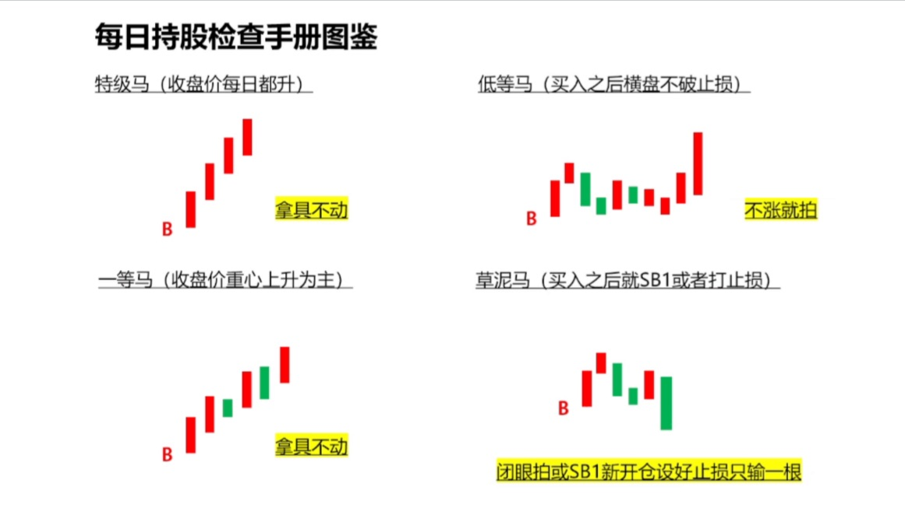

### 2025 年 4 月 28 日 （一招鲜如何骑牛）

- K 线，盘面语言
- 长下影阳线，多方完爆空方，后期看涨
- 长上影阳线，多方试盘遇阻回落，支撑不破看涨
- 长下影阴线，空方试盘遇阻反弹，压力不破继续看跌
- 长上影阴线，空方完爆多方，破低看空
- 小阴小阳十字星，容易成为反转 k
- 标准 k 线，实体大阳或者大阴，走势还将延续
- BBI， 多空的中线趋势线，横着的线可以不考虑，毫无交易价值，如果连续 2 根横住的话，减仓走人
- 核心指标， BBI + MACD + KDJ

### 2025 年 5 月 8 日 （永不套牢法）

- B1 买入，打开 BBI 趋势线，当 2 阳线的收盘价，远离 BBI 线，此时 KDJ 可能是 80 以上，可以减仓一半
- 找上升趋势，下跌 2 根 k 线收盘价跌破 BBI，可以轻仓不玩，注意交易纪律
- 只输一根 k 线，找到 kdj 大负值，在区间找 阶段低点和 高点，没有突破高点，90% 都是假突破
- 震荡期间就得注意 区间高点 和 低点
- 连续下跌趋势的，可以根据 macd 底背离，做交易性的机会

### 2025 年 5 月 15 日 （大 A 为什么这么弱 + 少妇战法）

- 有量化大 A 才有流动性
- 机构有机构玩法，机构可以拉高出货， 尾盘回落买回来， T + 0， 麒麟会也有麒麟会的做法
- 西方洋务派，不信，提前走了
- 牛市不踏空，熊市不被套
- 积小胜为大胜
- 择时选股
- 等 B1
- 被套设止损
- 放飞
- 收队
- 不同的票中阳线不一样，白酒 3-7%， 中石油 3%

### 2025 年 5 月 22 日 （小米发布会）

- 小兆的 3 种 交易都不臭
  - B1 进的，没有跌破 B1 止损价位，第一根阳线止盈，接着跌破 B1 的价位拍掉没问题
  - 也是 B1 进的，往上 BBI 只给了一根，后续跌破 B1 价格区间，拍掉也没问题
  - 不是 B1 进的但是和之前 B1 价格差不多进的，跌破区间价格拍掉也是正确的
- 减少交易频次
- 带着中线投资
- 分清主线投资还是主题投资，只做这 2 种
- Z 哥走了就不看
- 可以看，就是到 B1 了

### 2025 年 5 月 31 日 （少妇战法复习与曼城主力）

- 择时（经济周期、政策指引、增量资金、入场时机）
- 选股（政策、行业、龙头行业、资金、估值）
- 等 B1（主题等日线 B1、主线等周 B1）
- 设止损（当根 K 线最低点下面、N 型结构上一个低点）
- 止盈放飞（BBI 线上 2 根中大阳线减仓）
- 离场（连续 2 日收盘跌破 BBI 线）

### 2025 年 6 月 1 日 （如何复盘与短期策略之单针下 20）

- 低波红利
  - 定投
  - 日 B1 小买，周 B1 大买
  - 不要期望每次都是在最低点买入
  - 与国家同在
  - 风险是过去 6 年最大回撤 20%，要有思想准备
- 如何复盘
  - 看新闻（信息、政策、风向、舆情（是否噪音））
  - 看大盘（看市场、看指数）
  - 看热点（主线、主题、是否持续、是否有新的、是否有已经过时的）
  - 看持仓（持有逻辑、盘面关键点、是否出现买卖点、是否出现加减仓时机）
  - 选股
  - 制定第二天的交易计划（仓位管理、买、卖、买多少卖多少？）
- 单针下 20
  - 深 V 战法不要挑有下跌趋势的，只能摸 1-2 天
  - 连续 w 的可以考虑，红线一直在上方的可以考虑
  - 3，21 的指标，要在强势的周期上车
  - 红线的 80 以上，白线 20 以下，属于抄底，b1 抡，这一根下面做止损，可当成上涨中的快速洗盘
- 深 V 玩法(适合中强的大盘环境)
  - 主要解决错过 B1 买点后的新入场时机问题
  - 超短线策略，持有一个交易日必须脱离成本线
  - 没脱粒成本线，次日开盘就拍掉
  - 如果脱离成本线 3%以上，可以酌情继续持有，或放飞一半持有
  - 持有过程参考 BBI 线卖出策略
  - 只做 N 型结构连续上升图形，和 BBI 趋势向上的图形
  - 前晚选完，次日早盘抡，如果拍掉是下一日早盘（高开 3 个点以上看行情是否好是否进去）
  - 原则：买入这跟后必须涨，不涨就是错的，不要迷信任何指标
  - 例子：广发（2025-05-12）、晋亿实业（2011-01-19）、中国中铁（2015-04-13）

### 2025 年 6 月 11 日（真是案例主力散户如何博弈）

- 要想赚钱就找大哥
  - 一个 10 大哥，一般只有 4 个挣钱，4 个磨磨叽叽的，2 个炮灰
  - 麒麟会做不成是因为出不去货，找不到对手盘
  - 如何洗大哥
    - 拿货上涨，让大哥赚钱就走
    - 下杀继续洗，剩下大哥继续拿货
    - 横盘期间，大哥握手言和，约大哥出来
    - 规模越大，大哥打架时间越长，剩下的大哥越多
  - 流动性不好的时候，中小创会表现
  - 天时地利人和，总有一个欠缺的
- 公募进场的话，要么就是见顶，要么就是接盘
- 机构没法分仓，一般是基金母公司的席位
- 机构有保持仓位的规则，而且为了业绩只能追高，帮人锁仓，可以穿越牛熊
- 龙虎榜不要看游资 和 公募
- MACD 作用
  - 看背离
  - 上穿 0 轴
  - MACD 在 0 上， kdj 在大负值
- 麒麟会如何运作
  - 建仓（填坑）、洗盘（挖小坑）、拉升（天时地利人和）、出货（找对手盘）
  - 建仓，一般是从低位连续上涨，无介入机会，仓位持续增加（MACD 绿变红）
  - 洗盘，大跌，但是仓位不减（MACD 线上死叉）
  - 拉升阶段，连续小阳变大阳，下跌也能快速收回，仓位继续上升（MACD 线上二次金叉）
  - 出货，仓位线连续下降（MACD 顶背离，由红变绿）

### 2025 年 6 月 18 日（创新药概念逻辑）

- 如何看一个票高跟低
  - 看行业，是新兴的还是存在的，看基本面
  - 看票，如果价格还没超过首发价的价格，说明没怎么炒
  - 风险：有可能到前高就结束了
- 医药里面最赚钱的事创新药，咱们要向外授权
- 授权的三个赚钱模式
  - 首付款
  - 里程碑付款
  - 销售分成付款
- 持续关注的 5 个方向（前 5 个重要点）
  - 痛风（AR882）
  - 自免类
  - 肺癌类（小细胞肺癌类的，普通类的）
  - 类似于 deepseek 的，麻醉类（环泊酚）
  - 胰腺癌（西奥罗尼，adc 疗法）
  - 阿尔茨海默症（ZG006）
  - 糖尿病
- 从 IPO 开始，股价下跌，到会到 IPO 价格，这个历程叫填坑，估值修复，如果是先涨后跌属于还债

### 2025 年 6 月 25 日（挖坑出坑填坑）

- 什么是坑
  - 大坑，（大坑赚大钱）大波段，拿住不动，有前历史新高，连续长时间屁滚尿流，一路下跌，然后企稳一段时间
  - 小坑，（小坑赚小钱）小波段，少妇战法，有阶段高点，连续回调后企稳，同时不破阶段前低点，然后 J 到大负值
  - 小洞，（碎银子）波动，快进快出，就一根儿，连续 N 型上升趋势，出现黑天鹅，事件驱动，突然下杀，然后 J 到大负值
- 什么坑不能做
  - 大坑出现企稳后，先观察，不要轻易入场，等填完一个大坑回调后再说
  - 基本面不了解的不要碰
  - 行业题材不属于当前炒作主题或主线不要碰
- 什么坑能做
  - 大坑出现后，已经填完一个中型坑的
  - 填大坑过程中，N 型结构完美的，可以少妇战法
  - 市场机构共识的主线或主题出坑过程中，可以参与
- 填坑出坑的底层逻辑是什么？是主力对于目标价和成本价的控制
- 出坑期间放量是好事
- 出坑后大长阳，缩半量是最好的
- 有关键 K 的话，出坑回踩确认，到关键 K 的位置，说明有麒麟会
- 主力只会横盘或向下杀出货，边拉升边出货的比较少
- 坑越大，填的越快，出坑后，速度会放缓
- 在大盘没有特扑的时候先不要做出坑的

### 2025 年 7 月 2 日（择时之如何判断增量资金来否）

- 择时三要素
  - 宏观经济周期（次要）（天时）
  - 政策周期（地利）
  - 增量资金（人和）
    - 看利率（存准）
    - 看 MLF
    - 看资金（指南针的活跃市值指标）（标红的统称机构资金）（机构资金-把钱变成流通筹码-带来外盘成交量的变化）
      - 国家队（看非银行的借贷数据）（国家队 ETF 增持和减持的信息）
      - 社保（一年公布一次）
      - 险资
      - 公募（一个月 or 三个月看一次）
      - 券商自营（集合理财资管产品差看规模净值）
      - 私募（会被监管，暴露在阳光线）
      - 麒麟会
      - 游资
      - 散户
      - 外资
  - 如何判断增量资金（活跃市值用法）
    - N 型结构上升比较好
    - 阳包阴也是很好的信号
    - 何时跟随增量资金入场
      - 第一波增量资金在爬山坡，可关注资金流入的板块和概念，等回调
      - 小波段 4%阳线（炒主题， 增量资金去哪就干哪儿）
      - 大波段 5%-8%阳线（炒主线、炒主题、XJB 炒）
      - 十年一牛，连续 7%-20%阳线（随便买，拿住不动，总能轮到）
    - 何时跟随增量资金离场
      - 单日 2.3%左右的跌幅，大概率波段结束，开始减仓或清仓
- 曼城阵容
  - R1/R2/美债
  - 红利低波
  - 台子 11%
  - 队长 11%
  - 赛赛 12%
  - 发仔 13%
  - 迪迪 6%
  - 米儿 11%
  - 一皇 3%
  - 一后 3%
  - 白酒（智慧青花） 4%
  - 固态（宁德时代） 5%
  - 新消费（雪王） 10%
  - 创新药 （娜娜）10%
- 整体方向配置
  - 大科技龙头（队长、米儿）
  - 新消费（雪王、中宠、老铺、泡泡玛特）
  - 新能源车（赛赛迪迪）
  - 白酒
  - 创新药（相当于以前的新能源车，炒 5 年）
  - 固态电池（矿、膈膜正负极）
  - 券商
  - 稳定币（搞有牌照的，南华期货，新前锋）
  - 军工（无）
  - 机器人（无）
  - AIDC（锐捷网络）
  - 达链（无）
  - 游戏（无）
  - 可控核聚变（从第二波撤离）
- 图形知识
  - 85 度拉升一般都是假的，第一次 J 值回调后，上阴吊线会出现这种 85 度长上影
  - 股价横住，j 往上涨，大概率出货
  - 关键 K：每次放量上挑的大阳线
  - 活跃市值做补票成功率高点

### 2025 年 7 月 9 日（大富翁交易节奏）

- 市场的节奏
- 个股的节奏
- 你自己交易的节奏
- 呼吸节奏（上涨吸下跌呼）
- 突破前高的放量阳量或阴量 or 3/4 量，后面也是缩量的 ok
- 创新药后续方向
  - 替尔泊肽（减肥 + 增肌）
  - PD1
  - 阿兹海默
- 仓位管理
  - 2w 做到 100w，每天满仓抡 1 只（忍受最大回撤 50%-70%），2-5 年，容错率相对高
  - 2w 做到 10w，每天满仓抡 2 只（忍受最大回撤 30%-50%），1-3 年，容错率高
  - 2w 做到 5w，每天满仓抡 3 只（忍受最大回撤 15%-25%），3 个月，容错率低，换手要快，超短

### 2025 年 7 月 16 日（百战案例扎实基本功）

- 盘后如何选
  - 制定买入的日期
  - 计算盈亏比
  - 计算止损位
    - 赚钱的票马上回到成本价，拍掉
    - 买入之后该涨不涨，成本区附近甚至微亏，拍掉，不等
    - 破掉止损价格，拍掉
- 阶梯量下跌大概率是出货
- 建仓波底部起来放量长阳 25-50%，B1 可靠性大
- 拉升波，二次启动伴随着涨停板的放量中长阳 35-50%（不翻倍），竖着连续暴跌，B1 可考虑建仓，如果斜率不高，阶梯量连续下跌，等第二或第三个 b1，甚至是 sb1
- 冲刺波，伴随着连续涨停板，斜率很高上冲，顶部放量，B1 不做
- 额外图形知识
  - 横着好好的突然拉升，边建仓边拉升不碰
  - 7 外有 11，前期有接近 7 个板，竖着回调一般，B1 进，可期待一波
  - B1 进去之后第二天有长上影，可考虑不看

### 2025 年 7 月 20 日（充电闭门会）

- 雅鲁藏布江、墨脱水电站（基建 + 军工 + 中国国际地位提升）
- 想要加速，先得砸大坑
- 大资金还没进场（某队一览众山小，杠杆资金没进场、公募的也没怎么进场、险资进了点）
- 买到 3500，要么是某队、要么是麒麟会、要么就是自营盘
- 外资进场起码得等美国降 2-3 次息
- 2、9、10、11 赚钱概率大，5、6 月份最难(跟央妈放水有关系、为了公募业绩排名、kpi 等)
- 大 A 的历史上
- 66%的时间都是垃圾时间（拿住不动；或找比较好的票 少妇战法）
- 24%波动率还可以 没有黑天鹅（少妇战法）
- 只有 10%波动率很大的大牛市(亏钱点:短线追高)（加速时 拿住不动）
- _目前处于 24%阶段_
- 震荡区间的放量上涨，可以当成时建仓波
- 少妇战法短线怎么止损
  - 赚钱的票马上会到成本价，拍掉（盘中观察）
  - 买入后该涨不涨，成本区附近甚至微亏，拍掉，不等
  - 破掉止损价格，拍掉！（收盘时）
  - 唯一困扰的是心态（卖飞、持仓很久一卖就涨），所以纪律很重要
- SB1
  - 即使是阶梯下跌，B1 要抡的话要看极致缩量的那一根
  - SB1，比极致缩量的那一根放量还要多，要吓走那部分抄底的人
- 锦囊
  - 牛市也是高切低
  - 不要存款搬家

### 2025 年 7 月 23 日（麒麟会如何运作）

- 目前，除了沪深 300，绝大部分票都有大哥
  - 沪深 300 的大哥，那是真大哥
  - 吸、拉、派、落（吸，洗盘、再吸， 重复上述步骤，拉升。。。）
  - 一波流的 B1，除非直下可以 B1 抢反弹，否则放弃
  - 只做有清晰建仓波的回调 B1
  - 横盘等高低点，建仓波等回调，拉升波等洗盘，冲刺波后不看
- 麒麟会出货一般是横着，或者做双顶
- 涨停封板，炸板，可能是出货了
- 游资出货一般是 A 杀，踩踏
- 建仓先找放量，底部区域不分红绿色量
- 走流畅的上涨都是麒麟会允许的上涨
- 看图先看 N 型结构，是否逐级抬升
- 妖股都是合力出来的（深圳华强、大众交通）
- 阶梯量不做（底部横盘区域除外），缩半量最好
- 3/4 阴量线是根据突破前期颈线位置的大长阳的第二天是否 3/4 阴量
- 港股看基本面和趋势
- 涨停无量要斟酌，要干起码要求是前面的倍量
- 向上跳空的形式（冲刺、消息面、长期停牌后估值修复）
  - 冲刺阶段才有参与价值的 拉升没有
  - 如何判断非一波流，连续小阴小阳建仓，顶部无量，b1 极致缩量
  - 冲刺回来能够回来就是假的 赶紧卖
  - 跳空之后得涨停，不如熄火
  - 真正的特扑不回头
- 补票在横盘微涨区间补，顶部大风车之后诱多的一根不追
- B1 量比战法（解决如何买）
  - 10 以下都是算低量比，大概率要洗，等回调，1-3 分钟内决定态度，20 以上比较好
  - 高量比（10），低开（-2%），尽量不碰，观察择机建仓
  - 长江材料 7 月 8，抓涨停，看量比直拐头
  - B1 大于 20，微微低开，带量上攻可建仓

### 2025 年 7 月 30 日（如何防止卖飞）

- 踏空，方方面面全在你的策略之内，没有触发任何减仓或者清仓的情况下，你卖了
- 加仓点
  - 突破后，缩半量的 小阳线和小阴线
  - 大于 1/2 - 3/4 阳量，说明抛压小，盘子是干净的，随时往上蹬
  - 假阴真阳，说明吃了一肚子货，可能继续往上蹬
- 完美案例
  - 长安汽车（2012-12-19）
  - 江淮汽车（2024-09-06，回调不破突破大阳线的一半）
- 各种持股情况（连续卖飞的思考）
  - 有利润后怕失去，变敏感，容易在盘中回落的时候恐慌中卖出
  - 日内看盘容易被冲高回落吓到，而又没有耐心等到收盘前
  - 连续放飞后，只剩一小部分仓位后容易草率决定卖出，实际上是强迫症
  - 盘中猜顶卖出，实际上回到日线看一下就可以知道放没放量，是不是真的到顶了
  - 其实所有的卖飞决策不是那一刻的决定，而是连续日内看盘后出现的情绪集中释放
  - 高开买入量不够或者买入当天下跌套住，导致心态不稳，直接主观上就觉得不完美
  - 所有卖飞的票，当时都没有跌破 BBI 线，甚至每天的收盘价都在提高，全卖其实毫无依据
- 防止卖飞小技巧
  - 忽略盘中的冲高回落！冲刺阶段多为盘中或 2 日小阴线快速洗盘（德龙、发仔）
  - 当天下杀后，是否尾盘快速收回？是否第二天快速收回（昂利康、天阳）
  - 不要在下杀中卖出，去你妈的谁怕谁，有本事你打我止损
  - 不要在大盘突然下杀时，草率处理掉当天强势但同步下杀掉个股（幸福蓝海）
  - 如果收盘时缩量的小阴线，给再等一天（光电、发仔、西测）
  - 完美形态的票，不要主观判断，不破 BBI 线就给我拿住！（发仔、光电）
  - 要多看日线！看每天的收盘价是否还在提高！只要收盘价还在提高就不要怕！
  - 总结
    - 收盘价上升 + 不破 BBI 线 + 无巨量阴线 + 趋势还在向上（看前一个 N 型低点） + J 没死叉
    - 不要在意盘中到上蹿下跳，给老子他妈到拿住
- 特级马（收盘价每天都上升），可拿住不动，如中科金财，7 月 25 日
- 一等马（收盘价趋势上升为主），可拿住不动
- 低等马（买入后横盘不破止损），不涨就拍
- 草泥马（买入后 SB1 或者打止损），闭眼拍，或 SB1 新开仓设好止损只输一根
- 

### 2025 年 08 月 06 日（大盘回调期如何选出强壮的宝宝）

- 总逻辑，大盘每一次调整，都是市场资金切换的行为（切换到散户少的地方，如全新的概念）
- 总原则，弃弱留强，顺势而为（换更强壮的宝宝）
- 四个依据（大盘开始调的时候）
  - 还在继续上涨的，最强（趋势延续，防买飞策略）（幸福蓝海）
  - 跌幅不大，保持在 BBI 线上的（趋势不变，拿住不动）（康宏、方正、乐普）
  - 同步下跌，整体跌幅不大，能迅速缩量后继续随大盘放量快速反弹（趋势没坏，等待修复）（东岳、中坚、兆丰）
  - 同步大幅下跌，反弹弱甚至还在创新低点（趋势结束，果断跳车）（中游、天阳、华纳）
- 五个注意
  - 主题是否切换（B1 里看该主题走势结构，形态是否到顶（顶部是否放量）， 谁先调整谁先反弹）
  - 主题是否分化（需要试盘验证、调整仓位，小仓位配置去选出特级马）
  - 大小票是否切换（B1 里看该概念分布比例）
  - 是否高低切换（B1 里看该概念分布比例，看哪些是低位，哪些高位）
  - B1 买了 3 天内没起色拍了
- 如果要玩算力，看 4 个核心光刻机
  - 芯源微
  - 福晶科技
  - 同飞股份
  - 张江高科
  - 上海电气
  - 南大光电
