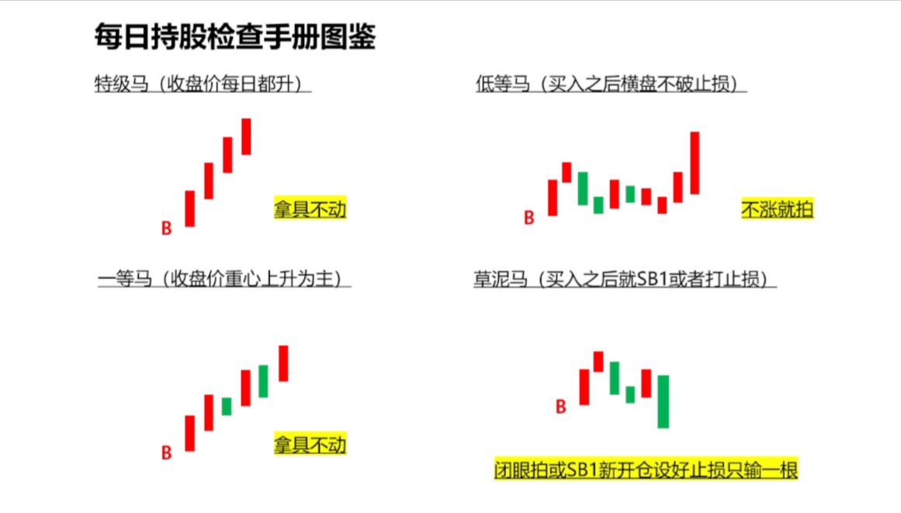

### 2025 年 4 月 28 日 （一招鲜如何骑牛）

- K 线，盘面语言
- 长下影阳线，多方完爆空方，后期看涨
- 长上影阳线，多方试盘遇阻回落，支撑不破看涨
- 长下影阴线，空方试盘遇阻反弹，压力不破继续看跌
- 长上影阴线，空方完爆多方，破低看空
- 小阴小阳十字星，容易成为反转 k
- 标准 k 线，实体大阳或者大阴，走势还将延续
- BBI， 多空的中线趋势线，横着的线可以不考虑，毫无交易价值，如果连续 2 根横住的话，减仓走人
- 核心指标， BBI + MACD + KDJ

### 2025 年 5 月 8 日 （永不套牢法）

- B1 买入，打开 BBI 趋势线，当 2 阳线的收盘价，远离 BBI 线，此时 KDJ 可能是 80 以上，可以减仓一半
- 找上升趋势，下跌 2 根 k 线收盘价跌破 BBI，可以轻仓不玩，注意交易纪律
- 只输一根 k 线，找到 kdj 大负值，在区间找 阶段低点和 高点，没有突破高点，90% 都是假突破
- 震荡期间就得注意 区间高点 和 低点
- 连续下跌趋势的，可以根据 macd 底背离，做交易性的机会

### 2025 年 5 月 15 日 （大 A 为什么这么弱 + 少妇战法）

- 有量化大 A 才有流动性
- 机构有机构玩法，机构可以拉高出货， 尾盘回落买回来， T + 0， 麒麟会也有麒麟会的做法
- 西方洋务派，不信，提前走了
- 牛市不踏空，熊市不被套
- 积小胜为大胜
- 择时选股
- 等 B1
- 被套设止损
- 放飞
- 收队
- 不同的票中阳线不一样，白酒 3-7%， 中石油 3%

### 2025 年 5 月 22 日 （小米发布会）

- 小兆的 3 种 交易都不臭
  - B1 进的，没有跌破 B1 止损价位，第一根阳线止盈，接着跌破 B1 的价位拍掉没问题
  - 也是 B1 进的，往上 BBI 只给了一根，后续跌破 B1 价格区间，拍掉也没问题
  - 不是 B1 进的但是和之前 B1 价格差不多进的，跌破区间价格拍掉也是正确的
- 减少交易频次
- 带着中线投资
- 分清主线投资还是主题投资，只做这 2 种
- Z 哥走了就不看
- 可以看，就是到 B1 了

### 2025 年 5 月 31 日 （少妇战法复习与曼城主力）

- 择时（经济周期、政策指引、增量资金、入场时机）
- 选股（政策、行业、龙头行业、资金、估值）
- 等 B1（主题等日线 B1、主线等周 B1）
- 设止损（当根 K 线最低点下面、N 型结构上一个低点）
- 止盈放飞（BBI 线上 2 根中大阳线减仓）
- 离场（连续 2 日收盘跌破 BBI 线）

### 2025 年 6 月 1 日 （如何复盘与短期策略之单针下 20）

- 低波红利
  - 定投
  - 日 B1 小买，周 B1 大买
  - 不要期望每次都是在最低点买入
  - 与国家同在
  - 风险是过去 6 年最大回撤 20%，要有思想准备
- 如何复盘
  - 看新闻（信息、政策、风向、舆情（是否噪音））
  - 看大盘（看市场、看指数）
  - 看热点（主线、主题、是否持续、是否有新的、是否有已经过时的）
  - 看持仓（持有逻辑、盘面关键点、是否出现买卖点、是否出现加减仓时机）
  - 选股
  - 制定第二天的交易计划（仓位管理、买、卖、买多少卖多少？）
- 单针下 20
  - 深 V 战法不要挑有下跌趋势的，只能摸 1-2 天
  - 连续 w 的可以考虑，红线一直在上方的可以考虑
  - 3，21 的指标，要在强势的周期上车
  - 红线的 80 以上，白线 20 以下，属于抄底，b1 抡，这一根下面做止损，可当成上涨中的快速洗盘
- 深 V 玩法(适合中强的大盘环境)
  - 主要解决错过 B1 买点后的新入场时机问题
  - 超短线策略，持有一个交易日必须脱离成本线
  - 没脱粒成本线，次日开盘就拍掉
  - 如果脱离成本线 3%以上，可以酌情继续持有，或放飞一半持有
  - 持有过程参考 BBI 线卖出策略
  - 只做 N 型结构连续上升图形，和 BBI 趋势向上的图形
  - 前晚选完，次日早盘抡，如果拍掉是下一日早盘（高开 3 个点以上看行情是否好是否进去）
  - 原则：买入这跟后必须涨，不涨就是错的，不要迷信任何指标
  - 例子：广发（2025-05-12）、晋亿实业（2011-01-19）、中国中铁（2015-04-13）

### 2025 年 6 月 11 日（真是案例主力散户如何博弈）

- 要想赚钱就找大哥
  - 一个 10 大哥，一般只有 4 个挣钱，4 个磨磨叽叽的，2 个炮灰
  - 麒麟会做不成是因为出不去货，找不到对手盘
  - 如何洗大哥
    - 拿货上涨，让大哥赚钱就走
    - 下杀继续洗，剩下大哥继续拿货
    - 横盘期间，大哥握手言和，约大哥出来
    - 规模越大，大哥打架时间越长，剩下的大哥越多
  - 流动性不好的时候，中小创会表现
  - 天时地利人和，总有一个欠缺的
- 公募进场的话，要么就是见顶，要么就是接盘
- 机构没法分仓，一般是基金母公司的席位
- 机构有保持仓位的规则，而且为了业绩只能追高，帮人锁仓，可以穿越牛熊
- 龙虎榜不要看游资 和 公募
- MACD 作用
  - 看背离
  - 上穿 0 轴
  - MACD 在 0 上， kdj 在大负值
  - 金叉空、死叉多
  - macd 随着股价 K 线量价齐升，可能是建仓波或者一波流
- 麒麟会如何运作
  - 建仓（填坑）、洗盘（挖小坑）、拉升（天时地利人和）、出货（找对手盘）
  - 建仓，一般是从低位连续上涨，无介入机会，仓位持续增加（MACD 绿变红）
  - 洗盘，大跌，但是仓位不减（MACD 线上死叉）
  - 拉升阶段，连续小阳变大阳，下跌也能快速收回，仓位继续上升（MACD 线上二次金叉）
  - 出货，仓位线连续下降（MACD 顶背离，由红变绿）

### 2025 年 6 月 18 日（创新药概念逻辑）

- 如何看一个票高跟低
  - 看行业，是新兴的还是存在的，看基本面
  - 看票，如果价格还没超过首发价的价格，说明没怎么炒
  - 风险：有可能到前高就结束了
- 医药里面最赚钱的事创新药，咱们要向外授权
- 授权的三个赚钱模式
  - 首付款
  - 里程碑付款
  - 销售分成付款
- 持续关注的 5 个方向（前 5 个重要点）
  - 痛风（AR882）
  - 自免类
  - 肺癌类（小细胞肺癌类的，普通类的）
  - 类似于 deepseek 的，麻醉类（环泊酚）
  - 胰腺癌（西奥罗尼，adc 疗法）
  - 阿尔茨海默症（ZG006）
  - 糖尿病
- 从 IPO 开始，股价下跌，到会到 IPO 价格，这个历程叫填坑，估值修复，如果是先涨后跌属于还债

### 2025 年 6 月 25 日（挖坑出坑填坑）

- 什么是坑
  - 大坑，（大坑赚大钱）大波段，拿住不动，有前历史新高，连续长时间屁滚尿流，一路下跌，然后企稳一段时间
  - 小坑，（小坑赚小钱）小波段，少妇战法，有阶段高点，连续回调后企稳，同时不破阶段前低点，然后 J 到大负值
  - 小洞，（碎银子）波动，快进快出，就一根儿，连续 N 型上升趋势，出现黑天鹅，事件驱动，突然下杀，然后 J 到大负值
- 什么坑不能做
  - 大坑出现企稳后，先观察，不要轻易入场，等填完一个大坑回调后再说
  - 基本面不了解的不要碰
  - 行业题材不属于当前炒作主题或主线不要碰
- 什么坑能做
  - 大坑出现后，已经填完一个中型坑的
  - 填大坑过程中，N 型结构完美的，可以少妇战法
  - 市场机构共识的主线或主题出坑过程中，可以参与
- 填坑出坑的底层逻辑是什么？是主力对于目标价和成本价的控制
- 出坑期间放量是好事
- 出坑后大长阳，缩半量是最好的
- 有关键 K 的话，出坑回踩确认，到关键 K 的位置，说明有麒麟会
- 主力只会横盘或向下杀出货，边拉升边出货的比较少
- 坑越大，填的越快，出坑后，速度会放缓
- 在大盘没有特扑的时候先不要做出坑的

### 2025 年 7 月 2 日（择时之如何判断增量资金来否）

- 择时三要素
  - 宏观经济周期（次要）（天时）
  - 政策周期（地利）
  - 增量资金（人和）
    - 看利率（存准）
    - 看 MLF
    - 看资金（指南针的活跃市值指标）（标红的统称机构资金）（机构资金-把钱变成流通筹码-带来外盘成交量的变化）
      - 国家队（看非银行的借贷数据）（国家队 ETF 增持和减持的信息）
      - 社保（一年公布一次）
      - 险资
      - 公募（一个月 or 三个月看一次）
      - 券商自营（集合理财资管产品差看规模净值）
      - 私募（会被监管，暴露在阳光线）
      - 麒麟会
      - 游资
      - 散户
      - 外资
  - 如何判断增量资金（活跃市值用法）
    - N 型结构上升比较好
    - 阳包阴也是很好的信号
    - 何时跟随增量资金入场
      - 第一波增量资金在爬山坡，可关注资金流入的板块和概念，等回调
      - 小波段 4%阳线（炒主题， 增量资金去哪就干哪儿）
      - 大波段 5%-8%阳线（炒主线、炒主题、XJB 炒）
      - 十年一牛，连续 7%-20%阳线（随便买，拿住不动，总能轮到）
    - 何时跟随增量资金离场
      - 单日 2.3%左右的跌幅，大概率波段结束，开始减仓或清仓
    - 活跃市值的 MACD 0 轴以上 二次金叉，开启主升浪，二次死叉或者 2.3%（优先以这个为准）波段结束
- 曼城阵容
  - R1/R2/美债
  - 红利低波
  - 台子 11%
  - 队长 11%
  - 赛赛 12%
  - 发仔 13%
  - 迪迪 6%
  - 米儿 11%
  - 一皇 3%
  - 一后 3%
  - 白酒（智慧青花） 4%
  - 固态（宁德时代） 5%
  - 新消费（雪王） 10%
  - 创新药 （娜娜）10%
- 整体方向配置
  - 大科技龙头（队长、米儿）
  - 新消费（雪王、中宠、老铺、泡泡玛特）
  - 新能源车（赛赛迪迪）
  - 白酒
  - 创新药（相当于以前的新能源车，炒 5 年）
  - 固态电池（矿、膈膜正负极）
  - 券商
  - 稳定币（搞有牌照的，南华期货，新前锋）
  - 军工（无）
  - 机器人（无）
  - AIDC（锐捷网络）
  - 达链（无）
  - 游戏（无）
  - 可控核聚变（从第二波撤离）
- 图形知识
  - 85 度拉升一般都是假的，第一次 J 值回调后，上阴吊线会出现这种 85 度长上影
  - 股价横住，j 往上涨，大概率出货
  - 关键 K：每次放量上挑的大阳线
  - 活跃市值做补票成功率高点

### 2025 年 7 月 9 日（大富翁交易节奏）

- 市场的节奏
- 个股的节奏
- 你自己交易的节奏
- 呼吸节奏（上涨吸下跌呼）
- 突破前高的放量阳量或阴量 or 3/4 量，后面也是缩量的 ok
- 创新药后续方向
  - 替尔泊肽（减肥 + 增肌）
  - PD1
  - 阿兹海默
- 仓位管理
  - 2w 做到 100w，每天满仓抡 1 只（忍受最大回撤 50%-70%），2-5 年，容错率相对高
  - 2w 做到 10w，每天满仓抡 2 只（忍受最大回撤 30%-50%），1-3 年，容错率高
  - 2w 做到 5w，每天满仓抡 3 只（忍受最大回撤 15%-25%），3 个月，容错率低，换手要快，超短

### 2025 年 7 月 16 日（百战案例扎实基本功）

- 盘后如何选
  - 制定买入的日期
  - 计算盈亏比
  - 计算止损位
    - 赚钱的票马上回到成本价，拍掉
    - 买入之后该涨不涨，成本区附近甚至微亏，拍掉，不等
    - 破掉止损价格，拍掉
- 阶梯量下跌大概率是出货
- 建仓波底部起来放量长阳 25-50%，B1 可靠性大
- 拉升波，二次启动伴随着涨停板的放量中长阳 35-50%（不翻倍），竖着连续暴跌，B1 可考虑建仓，如果斜率不高，阶梯量连续下跌，等第二或第三个 b1，甚至是 sb1
- 冲刺波，伴随着连续涨停板，斜率很高上冲，顶部放量，B1 不做
- 额外图形知识
  - 横着好好的突然拉升，边建仓边拉升不碰
  - 7 外有 11，前期有接近 7 个板，竖着回调一般，B1 进，可期待一波
  - B1 进去之后第二天有长上影，可考虑不看

### 2025 年 7 月 20 日（充电闭门会）

- 雅鲁藏布江、墨脱水电站（基建 + 军工 + 中国国际地位提升）
- 想要加速，先得砸大坑
- 大资金还没进场（某队一览众山小，杠杆资金没进场、公募的也没怎么进场、险资进了点）
- 买到 3500，要么是某队、要么是麒麟会、要么就是自营盘
- 外资进场起码得等美国降 2-3 次息
- 2、9、10、11 赚钱概率大，5、6 月份最难(跟央妈放水有关系、为了公募业绩排名、kpi 等)
- 大 A 的历史上
- 66%的时间都是垃圾时间（拿住不动；或找比较好的票 少妇战法）
- 24%波动率还可以 没有黑天鹅（少妇战法）
- 只有 10%波动率很大的大牛市(亏钱点:短线追高)（加速时 拿住不动）
- _目前处于 24%阶段_
- 震荡区间的放量上涨，可以当成时建仓波
- 少妇战法短线怎么止损
  - 赚钱的票马上会到成本价，拍掉（盘中观察）
  - 买入后该涨不涨，成本区附近甚至微亏，拍掉，不等
  - 破掉止损价格，拍掉！（收盘时）
  - 唯一困扰的是心态（卖飞、持仓很久一卖就涨），所以纪律很重要
- SB1
  - 即使是阶梯下跌，B1 要抡的话要看极致缩量的那一根
  - SB1，比极致缩量的那一根放量还要多，要吓走那部分抄底的人
- 锦囊
  - 牛市也是高切低
  - 不要存款搬家

### 2025 年 7 月 23 日（麒麟会如何运作）

- 目前，除了沪深 300，绝大部分票都有大哥
  - 沪深 300 的大哥，那是真大哥
  - 吸、拉、派、落（吸，洗盘、再吸， 重复上述步骤，拉升。。。）
  - 一波流的 B1，除非直下可以 B1 抢反弹，否则放弃
  - 只做有清晰建仓波的回调 B1
  - 横盘等高低点，建仓波等回调，拉升波等洗盘，冲刺波后不看
- 麒麟会出货一般是横着，或者做双顶
- 涨停封板，炸板，可能是出货了
- 游资出货一般是 A 杀，踩踏
- 建仓先找放量，底部区域不分红绿色量
- 走流畅的上涨都是麒麟会允许的上涨
- 看图先看 N 型结构，是否逐级抬升
- 妖股都是合力出来的（深圳华强、大众交通）
- 阶梯量不做（底部横盘区域除外），缩半量最好
- 3/4 阴量线是根据突破前期颈线位置的大长阳的第二天是否 3/4 阴量
- 港股看基本面和趋势
- 涨停无量要斟酌，要干起码要求是前面的倍量
- 向上跳空的形式（冲刺、消息面、长期停牌后估值修复）
  - 冲刺阶段才有参与价值的 拉升没有
  - 如何判断非一波流，连续小阴小阳建仓，顶部无量，b1 极致缩量
  - 冲刺回来能够回来就是假的 赶紧卖
  - 跳空之后得涨停，不如熄火
  - 真正的特扑不回头
- 补票在横盘微涨区间补，顶部大风车之后诱多的一根不追
- B1 量比战法（解决如何买）
  - 10 以下都是算低量比，大概率要洗，等回调，1-3 分钟内决定态度，20 以上比较好
  - 高量比（10），低开（-2%），尽量不碰，观察择机建仓
  - 长江材料 7 月 8，抓涨停，看量比直拐头
  - B1 大于 20，微微低开，带量上攻可建仓

### 2025 年 7 月 30 日（如何防止卖飞）

- 踏空，方方面面全在你的策略之内，没有触发任何减仓或者清仓的情况下，你卖了
- 加仓点
  - 突破后，缩半量的 小阳线和小阴线
  - 大于 1/2 - 3/4 阳量，说明抛压小，盘子是干净的，随时往上蹬
  - 假阴真阳，说明吃了一肚子货，可能继续往上蹬
- 完美案例
  - 长安汽车（2012-12-19）
  - 江淮汽车（2024-09-06，回调不破突破大阳线的一半）
- 各种持股情况（连续卖飞的思考）
  - 有利润后怕失去，变敏感，容易在盘中回落的时候恐慌中卖出
  - 日内看盘容易被冲高回落吓到，而又没有耐心等到收盘前
  - 连续放飞后，只剩一小部分仓位后容易草率决定卖出，实际上是强迫症
  - 盘中猜顶卖出，实际上回到日线看一下就可以知道放没放量，是不是真的到顶了
  - 其实所有的卖飞决策不是那一刻的决定，而是连续日内看盘后出现的情绪集中释放
  - 高开买入量不够或者买入当天下跌套住，导致心态不稳，直接主观上就觉得不完美
  - 所有卖飞的票，当时都没有跌破 BBI 线，甚至每天的收盘价都在提高，全卖其实毫无依据
- 防止卖飞小技巧
  - 忽略盘中的冲高回落！冲刺阶段多为盘中或 2 日小阴线快速洗盘（德龙、发仔）
  - 当天下杀后，是否尾盘快速收回？是否第二天快速收回（昂利康、天阳）
  - 不要在下杀中卖出，去你妈的谁怕谁，有本事你打我止损
  - 不要在大盘突然下杀时，草率处理掉当天强势但同步下杀掉个股（幸福蓝海）
  - 如果收盘时缩量的小阴线，给再等一天（光电、发仔、西测）
  - 完美形态的票，不要主观判断，不破 BBI 线就给我拿住！（发仔、光电）
  - 要多看日线！看每天的收盘价是否还在提高！只要收盘价还在提高就不要怕！
  - 总结
    - 收盘价上升 + 不破 BBI 线 + 无巨量阴线 + 趋势还在向上（看前一个 N 型低点） + J 没死叉
    - 不要在意盘中到上蹿下跳，给老子他妈到拿住
- 特级马（收盘价每天都上升），可拿住不动，如中科金财，7 月 25 日
- 一等马（收盘价趋势上升为主），可拿住不动
- 低等马（买入后横盘不破止损），不涨就拍
- 草泥马（买入后 SB1 或者打止损），闭眼拍，或 SB1 新开仓设好止损只输一根
- 

### 2025 年 08 月 06 日（大盘回调期如何选出强壮的宝宝）

- 总逻辑，大盘每一次调整，都是市场资金切换的行为（切换到散户少的地方，如全新的概念）
- 总原则，弃弱留强，顺势而为（换更强壮的宝宝）
- 四个依据（大盘开始调的时候）
  - 还在继续上涨的，最强（趋势延续，防买飞策略）（幸福蓝海）
  - 跌幅不大，保持在 BBI 线上的（趋势不变，拿住不动）（康宏、方正、乐普）
  - 同步下跌，整体跌幅不大，能迅速缩量后继续随大盘放量快速反弹（趋势没坏，等待修复）（东岳、中坚、兆丰）
  - 同步大幅下跌，反弹弱甚至还在创新低点（趋势结束，果断跳车）（中游、天阳、华纳）
- 五个注意
  - 主题是否切换（B1 里看该主题走势结构，形态是否到顶（顶部是否放量）， 谁先调整谁先反弹）
  - 主题是否分化（需要试盘验证、调整仓位，小仓位配置去选出特级马）
  - 大小票是否切换（B1 里看该概念分布比例）
  - 是否高低切换（B1 里看该概念分布比例，看哪些是低位，哪些高位）
  - B1 买了 3 天内没起色拍了
- 如果要玩算力，看 4 个核心光刻机
  - 芯源微
  - 福晶科技
  - 同飞股份
  - 张江高科
  - 上海电气
  - 南大光电

### 2025 年 08 月 13 日（选牛股大最核心逻辑）

- 常规量化选股工作流
- 初选池
  - 基于大模型的识别（ChatGPT、 DeepSeek）
  - 基于股票软件的技术指标组合（通达信、同花顺、文华财经）
  - 基于 python 的多因子模型或事件驱动模型（quant connect、trade station、zipline、vn、back trader 等）
- 终选池（基于本地部署）
  - 洗数据
  - 沙漏
  - 打分
- 策略安排
  - 具体触发条件
  - 仓位管理
  - 风控管理
- 具体交易执行（忽略）
- 异动，60 日线附近，突然放量，价随量升
- 地量地价，上升趋势后，异动出现 b1 的地量地价，才算得上是波段低价
- 60 日线底下或者附近上来的异动越强，后面的空间越大
- 连续莫名其妙异动（又高又大）和连续堆量异动（相对高位多根）
- 龙头在经历一波下跌后，在大盘调整期间，K 线没有低于之前的地量地价的
- 底部 60 日线三个涨停起来，三外有三（国盛 6.23-8.13）
- 60 日线往上拐后改变趋势的票可以碰，60 日线下的 b1 基本都是假突破
- 锁仓拉升，就是做 T
- 异动后的阶梯量要等足够长的 sb1

### 2025 年 08 月 19 日（如何买到当日最强）

- 为什么总买不到涨的最好的那个？
  - 一追进去就跌，一卖就涨！（这是事实）
    - Why？对 N 型结构和相对高低位置没有概念
  - 死拿的票就不涨，一卖就涨！（这是事实）
    - Why？洗的就是你这类的对手盘，你们不把筹码充分交换，我肯定不拉
  - 多选一必选错（这是事实）
    - Why？就是要让你迷惑，激发你的恐惧与贪婪，让你犯错误
  - 原本想买，但没买，买了就跌，没买的涨（这是错觉）
    - Why？因为认知不够，所以原本你就不想买，所以这是你认知内以为的事实，实际上是错觉
  - 不敢买的一直涨，买进去的一直不动（这是事实）
    - Why？因为你对股票和股票市场的运行规律一无所知，记住，强者恒强。
  - 买的多的涨的少，买的少的涨的多（这是事实）
    - Why？好东西都稀缺，能让你舒舒服服买到的东西，要么是你认知内的机会，要么就是这东西根本不值钱，两种顺势要清楚
- 如何避免总是选错的问题
  - 不选择那些看起来更安全的标的，拥抱看起来很吓人的高风险选择（通常高风险都是你主观认为的高风险）
  - 一定要清除主观偏好，不要对不知名、印象不好、认知不强的票就天然排斥
  - 一定要选择同板块内最强的，比如最早上攻，开盘量比最大且同步上涨的
  - 为了更大可能避免错误，不行就全买
- 我们要如何做
  - （买前）只选最美（只选完美图形、配置思维、不要小路过载）
  - （盘中）只买最强（不预先期待、盘中不幻想、谁强干谁）
  - （买完）只拿最硬（物来则应、不留恋、不给第二次机会），物来则应（见招拆招，跌了止损，涨了放飞或者一直持有）
- 选了 B1 后，第二天开盘如何买
  - 低量比开盘（10 以下），今日大概率还是震荡，等回调慢慢买入
  - 低量比开盘，无大幅下跌，今日大概率震荡市，强庄股或在下午随量比同步拉升
  - 高量比开盘（20 以上最好），开盘后股价上涨，进入大概率上攻
  - 高量比开盘，开盘后大幅度下跌，稳一手，除非带量冲破日内高点，否则大概率单边下跌或转水下震荡
  - 中量比开盘（7-16），量价同步上涨，进入大概率单边上涨
  - 中高量比（10 以上）大幅低开（-2%以上），先观察，每次加速下杀时或尾盘建仓
- 少妇战法短线如何止损
  - 赚钱的票有过上涨行为后，马上回到成本价，拍掉（盘中关注）
  - 高手的话，买入后该涨不涨，成本区附近甚至微亏，拍掉不等（英科医疗）
  - （没时间看盘，看日线），B1 买日后 3 个交易日还没脱离成本区，又没打止损，多等一天
  - 破掉止损价格，拍掉（收盘时）
  - 破掉止损价格，出现 SB1，可以酌情合并同类项加仓再等一根

### 2025 年 08 月 24 日（牛市如何逃顶）

- 三个卖点（小票 s1，s2 就得走了）
  - S1，加速上涨的过程中，出现的天量阴线，可放飞一半或者 1/3
  - S2，双头，创新高，macd 顶背离，前提是前面有放过巨量
  - S3，反弹到 S2 后放巨量的 K 线下沿，形成了压力位，很难挑上去（小米 20250127）

### 2025 年 08 月 26 日（指数贡献）

- 白酒四季度，医药看明年
- 指数贡献策略，从上证科创深成指等权重股大指数中找到对应权重股等贡献指数
  - 在大指数行情里面，就可以抡对应权重股
  - 按板块或者概念分
  - 非银金融是概念
  - 可以配纯血和混血的有指数贡献的票（例如券商，中信纯券商， 东方财富有多概念）

### 2025 年 09 月 03 日（10 张完美图）

缩量小阴小阳范围-1.95%到 1.79% 1-4 是完美 1，5-7 是完美 2，完美 2 一般是一个月洗到大哥线起来，9 是完美 3，特点是异动后横盘启动，也是 n 型结构，10 是完美 4，特点是缩量拉升，高位无出货迹象背后逻辑是分歧转一致的反转 k（缩量 k，涨跌幅在-2%到 2%，600 振幅 4%，300，00，688 开头振幅 7%）

- 完美图形案例

  1. 华纳药厂，20250512（破黄线收回来是震仓作用）
  2. 宁波韵升，20250806
  3. 微芯生物，20250620
  4. 方正科技，20250723
  5. 澄天伟业，20250717
  6. 国轩高科，20250801
  7. 野马电池，20250731
  8. 光电股份，20250710
  9. 新瀚新材，20250801
  10. 昂利康，20250711

- 选股条件：

  1. 相比前高放量成交量，极致缩量 k 线
  2. 涨幅为-2%到 1.8%
  3. 振幅 7%以内
  4. 白线大于黄线（无死叉）

### 2025 年 09 月 06 日（心法）

大盘下跌回调后，个股第一时间反弹，可能是主力被套，或者是原本就洗干净了，箭在弦上不得不发，也有得票主力是想等一下券商炒纯血，炒混血，炒业绩业绩如何来，中信旗下华夏公募基金，发仔旗下易方达基金，东方证券（牛市里爆发）

1. 盘子小切大
2. 景气度高的票（有业绩支撑的，是符合未来趋势的），有可能延续
3. 低估值（7 月份前牛逼），钢铁银行保险，管理指数的
4. 低波动，水力煤炭公共事业
5. 低估值，白酒
6. 高切低，切估值，板块内市值小切大
7. 优选高成长的票（如科技，游戏，半导体，消费电子），旅游新消费食品饮料（安全），金融非银金融金融科技（券商银行保险），低波红利，周期类
8. 化工后续还会涨价

### 2025 年 09 月 10 日(牛市偷懒法之 ETF 躺平策略)

- 策略前提条件
  - 牛市强趋势阶段开启
  - 增量资金源源不断
  - 不会选股，或开超市操作不过来，又怕踏空
- 具体策略
  - 主线 ETF 与主题 ETF 组合配置
- 关键执行
  - B1 买入，波段持有、波段切换
- 关键风险
  - 加速不卖
  - 破位不卖
  - 倒金字塔加仓
- 左侧尾盘再说，右侧开盘就干

### 2025 年 09 月 14 日(如何做一位斗牛士)

- 需要勇敢、决心、技巧
- 技巧
  - 明确知道你骑的是什么牛，B1 是挖掘牛，等着钱来找你，没来就换牛，B2 是买入确定牛，等着进入加速通道，不进就换，B3 是箭在弦上不得不发牛，买入必须要涨，不涨马上撤
  - 突破向上后，紧紧抓住白 dff 线，不下白线不卖
  - 建立自己的长期股票池，到了 B1 反复抡（行业分散）
  - 锻炼自己的骑牛能力，买入 1-2 手你特别看好的票拿住不动，一直到牛市见顶，然后复盘找感觉
  - 可以摔下，但不可害怕，怕，你就会输一辈子

### 2025 年 09 月 17 日(主力出货的 5 种方式)

- 加速后单日放天量大阴线，
  - (中材科技 25.8.29、中国中铁 14.12.22、 15.6.8、 镇洋发展 25.9.3、 光线 25.2.17)
- 加速后次高点突然巨量长阴
  - (民生银行 13.2.7-2.8、东财 20.7.16-17、 宁德 21.12.7)
- 新高后连续阶梯放量下跌;
  - (民生银行 25.7.21-8.15、万科 18.1.29、 晋亿实业 25.8.14)
- 双头双放量巨阴
  - (卫宁健康 25.2.17-3.10)
- 顶部绿长红短;
  - (中色 10.10.18-11.16、华谊兄弟 13.9.24-10.22)

\*注意盘子越大出货方式越综合(中信证券 25、东财 19.2.26、 中国中车 15.4.20)

### 2025 年 09 月 24 日（散户一定要删除的五种思维）

1. 目标错误!如果要定:轻易不亏钱!（不要定线性目标，例如每个月赚 10%-20%，但是这个不大可能，例如 9 月份龙队控指数交换筹码，难赚钱）
2. 太容易被市场吸引注意力，从而影响心态!（专注于自己的票身上，例如破白线考虑清仓）
3. 想赢怕输!（怕亏钱）
4. 线性思维! 一切皆有可能。应对!止损!放飞!等着!砍掉换!忍着
5. 策略执行不坚定!

用自己输得起的钱多练习建立自信多研究（高手的）稳健的买卖法

### 2025 年 10 月 06 日（三大高爆发力的 B2 买入法）

- 什么是 B1，B2，B3
  - B1，不同时间周期下的阶段低点位置;
  - B2，不同时间周期下的 B 1 低点确认阳线位置;
  - B3，不同时间周期下持续上涨波段内的 B2.上涨后的中继位置。
- B1，B2，B3 的优劣势?
  - 按照盈亏比排名: B1 > B2> B3;
  - 按照上涨确定性排名: B3> B2> B1;
  - 按照止损幅度排名: B2 > B3 > B1。
- B1，B2，B3 买入后的走势期待?
  - B1，3 个交易日内恢复上涨;
  - B2，2 个交易日内必须大幅拉升;
  - B3，不破 B3 阳线最低点都可以。
- B1，B2，B3 如何设置止损?
  - B1，买入 K 线最低点或向下 3-5 个价位;
  - B2，N 型结构前低;
  - B3，突破大阳线的中间位置。
- B2 常规战法（K 线 N 型结构顺势而为）
  - 昂利康 20250714
  - 中色股份 20100927
  - 中大力德 20250804
- B2 三大暴力图形
  - 平行重炮（相对平行位置放量长阳）
    - 中坚科技 20250801
    - 百普赛斯 20250624
    - 南亚新材 20250813
    - 世运电路 20250905
    - 中富电路 20250811
    - 四会富士 20250828
    - 国盛金控 20250811
    - 国义招标 20250708
    - 财富趋势 20250811
  - 灾后重建（缩量回踩大哥线后震仓启动）
    - 晶科科技 20250807
    - 美迪西 20250623
    - 安德利 20250423
  - 跃跃欲试（横盘震荡的中大阳线）
    - 鼎捷数智 20250709
    - 潮宏基 20250516
    - 海天瑞生 20250708
    - 路桥信息 20250623
    - 幸福蓝海 20250710
    - 奔朗新材 20250710
    - 新瀚新材 20250804
- 如何选 B2
  - B1 之后
  - 涨幅大于 4%
  - 比前一交易日放量
  - J<55
  - 无上影线最好

### 2025 年 10-11 月（汇总）

- 重视香港在国际的金融地位，路线是东南亚英国北美
- 3 个服务经济
  - 体验消费
  - 精神消费
  - 传统消费再创新
- 留意国资用保险举牌的动作
- 化工化纤没故事，只能看业绩政策和大盘，要盯着 PPI
- 特高压找高铁炒作那一波
- 上涨趋势的股东减持不重要
- 有色跟的是经济周期，和货币政策
- 紧盯活跃值，缩量上涨的必定回调
- 美元涨大宗大概率跌
- 黄白铂钯铜铝橡胶钢铁
- 光线传媒高位为啥那么多承接（热度到了，真有对手盘接了，收割量化）
- 底部有涨停板，可能是新庄入场
- 黄白线逻辑
  - 上证白线在上，黄线不同步的趋势的话，可能是中小票在出货（下跌区域）
  - 上证黄线在上，白线在下可能大盘在出货，黄线在进货（白线在下跌区域，黄线在上涨区域）
  - 同步往上，可能都在进货
  - 同步往下，谁也出不去货
  - 原理就是释放流动性，等量资金的情况下，有资金出来了，才能去别的方向
- `十三五（创新驱动、基础布局）（没有未来规划，在追赶）`
  - 新一代信息通信技术（5g）
  - 新能源（光伏、新能源车、锂电），3-5 年爆发
  - 商业航天，累计 10 年爆发
  - 生物医药，2025 才爆发
  - 智能制造（小米华为小鹏大疆等大企业的全面发展），2-3 年爆发
  - 数字创业（偏文化精神）
  - 税收优惠政策，研发费用加计扣除 75%
- `十四五（自立自强、产业升级）（没有未来规划，在追赶）`
  - 集成电路（中芯国际、光刻机、存储）
  - 人工智能（大模型、DeepSeek）
  - 量子信息
  - 脑科学（脑机接口，清华浙大的纯血没有上市）
  - 生物育种（医疗器械，AI 医疗，智能医疗）
  - 区块链（数字人民币， RWA）
  - 北斗产业（星链， 偏军工）
- `十五五（超常规突破、未来产业）`
  - 集成电路（卡脖子）
  - 工业母机（机械臂，机器手等卡脖子）
  - 高端仪器（医疗为主）
  - 基础软件（卡脖子）
  - 具身智能
  - 脑机接口
  - 低空经济
  - 氢能核聚变
  - 6G 通信
- 最可能 10 倍的，AIGC 和 存储芯片

- `老登股`：白酒、煤炭、有色、化工、银行、券商、稀土、锂矿、保险
- `中登股`：新能源车、金融科技、大科技
- `小登股`：半导体、固态、特高压、创新药、人形机器人、AIGC、脑机接口、可控核聚变、储能、算力、液冷、存储
  - 安全板块
    - 白酒、化工、新能源车、特高压、AIGC
  - 白热化板块
    - 煤炭、有色、银行、券商、稀土、锂矿、保险、金融科技、大科技
  - 烫手板块
    - 半导体、固态、创新药、人形机器人、脑机接口、可控核聚变、储能、算力、液冷、存储
- `2025Q4 曼城阵容`：
  - 前锋：有色
  - 中锋：特高压、券商、队长
  - 后卫：白酒、煤炭、红利低波
- `仓位管理`
  - 波段用分仓（易），短线用重仓（难）
  - 千万不要用分仓做短线，用重仓做波段
  - 分仓或重仓，比例取决于你接受的单仓跌停幅度
  - 分仓的目标是让自己睡得着觉
  - 重仓的目标是快速赚到爆发的差价
- `三句忠告`
  - 不要对股票有感情（尊重盘面）
  - 该止损止损（只输一根）
  - 赚钱的票不要做亏（亏了要认！）
- `2026年四大投资主线`
  - AIGC
  - 特高压
  - 精神消费（游戏）
  - 军工
  - 创新药不再炒故事，关注业绩和商业开发（business development）
- AIGC + 新消费（2025 大部分的钱都往这俩方向）
- 低于出厂价的茅台都是勾兑的，你还无法维权
- 房子和股市都是 2 个蓄水池，哪个蓄水池空了，就用哪个池子接水
- 中国市场的低估与财富转移:
  - 市场低估现状：中国大市场被世界严重低估，主要体现在整体经济生态而非仅股市。
  - 财富转移逻辑：财富并未消失，而是从旧业态流向新业态，如线下店铺萎靡对应线上销售的爆发。
  - 成本与收入转移：线下房租水电成本转化为线上平台流量费，品牌直营模式兴起，平台赚取过去商场与经销商的利润总和。
- 资产价格的高低位分化:
  - 房价高位判断：以租售比为例，如上海保利世博天院，售价 3200 万，月租金 3.2 万，年租金回报极低，表明房价仍处高位。
  - 房产是否为资产：资产定义是能带来正向现金流，若租金收益不足以覆盖折旧与成本，则房产实为负债。
  - 中美房地产逻辑差异：中国无法复制美式财富收割模式，房地产处于出清阶段，未来需等待人均收入提升支撑价格。
- 提高收入的多元途径:
  - 工资增长外的收入渠道：包括资产增值、灰色收入、股权增值、传统投资、拆迁补偿、人民币购买力提升等。
  - 人民币购买力实例：如雅阁汽车 20 年前售价 34 万，现仅 16 万，生产效率提升导致成本下降，市场竞争压价，消费者受益。
  - 综合收入提升逻辑：国家通过控制物价、打压房价、车价等方式，间接提升居民实际购买力，未来收入增长将是多渠道叠加的结果。
- 全球货币锚定黄金后的资产重估
  - 中美货币总量相近，但黄金价格差距巨大
    - 美国黄金已登至$4000/盎司，通胀翻倍。
    - 中国多数资产尚未跟随黄金上涨。
  - 历史规律：黄金暴涨后其他资产补涨
    - 黄金作为货币锚，其价格飙升预示所有可计价资产将逐步重估。
    - 过去 5–10 年数据显示，黄金大涨后各类资产普遍迎来上涨周期。
  - 被严重低估的资产类别
    - 大 A 股市：平均市盈率仅 13.7 倍。
    - 各类物资：包括食物、日用品等实物价格偏低。
- 来趋势推演
  - 物资价格上涨 → 企业收入改善 → 利润提升 → PE 下降 → 股市估值更具吸引力。
  - 形成正向循环，直至与黄金锚定价值匹配。
- 地域价格差异举例
  - 成都瑜伽裤台费被低估，上海、杭州、深圳被高估。
  - 酒店、鞋子、汽车价格普遍偏低，未来将向一线城市看齐。
  - 反向投资机会：在新能源车热潮中关注 16 万雅阁、14 万帕萨特等传统燃油车。
- 估值回升的三大路径
  - 第一步：讲好中国故事，吸引国际资金
    - 低价源于国际认知不足（如赛力斯不被海外了解）。
    - 需提升国际影响力，引导增量外资流入。
  - 第二步：国内主导部门主动引导定价
    - 财政与“龙队”通过配置银行股，示范大 A 重估。
    - 主动拉升碳酸锂等关键资源价格，制造示范效应。
  - 第三步：扩大货币发行（印钱防水）
    - 近年中国印钞克制，故人民币购买力强。
    - 美联储扩表在即，中国将跟随放水。
    - 放水路径非直接涨工资，而是通过资产价格上涨惠及民众。
- `板块轮动顺序示例：`
  - 新能源 → 固态电池 → 可控核聚变
  - 锂电 → 传统能源（石油、煤炭）
  - 半导体芯片 → AIGC → 大消费
- 每日 5 步工作流
  - 定策略，根据市场趋势确定仓位与操作方式：
    - 松：满仓轮动，可操作 B1、B2、B3。
    - 紧：轻仓或空仓，仅操作 B1，严格止损。
  - 复盘 ，检查持仓，明确次日操作：
    - 止损：跌破关键 K 线低点或黄线。
    - 放飞：出现中长阳线（>4%）。
    - 滴滴：跌破白线。
  - 选股，每日坚持选股，根据市场情况筛选 B1 信号，条件可适当收紧。
  - 执行
    - 开盘买：集合竞价结束后，根据量比决定买入时机。
      - 高量比 (>20)：直接买入一半仓位。
      - 中量比 (7-16)：量价同步上涨时买入。
      - 低量比 (<10)：无大幅下跌则可能震荡。
    - 收盘卖：在 2:50-2:55 检查持仓，执行止损、放飞或滴滴。
  - 量比实战应用指南
    - 标准版量比规则
    - 低量比开盘 (<10)：若无大幅下跌，当日大概率震荡，强庄股可能下午随大盘拉升。
    - 高量比开盘 (>20)：若股价上涨，当日大概率上攻；若大幅下跌，则需谨慎，除非带量突破日内高点。
    - 中量比开盘 (7-16)：量价同步上涨，当日大概率单边上涨。
    - 中高量比大幅低开：特殊战法，观察加速下杀时的成交量峰值，在该位置建仓。市场展望与宏观分析
    - 当前市场判断  
      市场处于空头区间，反弹乏力，需等待二次探底。
  - MACD 波段底部识别
    - MACD 从零轴上方下穿至下方，接近前一波段极值区间（如-5%）时，可视为波段底部。
  - 政策与流动性预期  
    预计明年一季度末二季度初释放流动性，春节前或有一次行情启动机会。

### 2025 年 12 月 16 日 交易松紧手

`手紧原则`

- 看天-择时为空头趋势，则执行手紧原则
  - 大盘在黄线下
  - 活跃市值出现-2.3%
- 看地-只做最完美的形态，不将就，总仓位控制在 0-50%
  - B1 可做
  - B2 不做
  - B3 不做
- 手法，市场没有证明你是对的时候就说明你错了
  - 不涨就拍
  - 托起来就卖
  - 止损点一到就卖
  - 盈转亏点必须卖
  - 感觉不好也卖

`手紧原则`

- 看天-择时为多头趋势，则执行手松原则
  - 大盘在白线之上
  - 活跃市值还在+4%波段内
- 看地-各种策略都可执行，总仓位控制在 80-100%
  - B1 可做
  - B2 可做
  - B3 可做
  - 补票可做
- 手法-拿住不动

  - 托起来开始逐步放飞
  - 白线牵牛绳
  - 止损放在前一个 N 型低点
  - 可在 SB1 位置加仓一次
  - 盈转亏点必须卖

- 闲谈

  - 连续 6-9 连阴，起来的反弹就一根，尤其是收紧的时候
  - 50 亿以下最好不碰
  - 有历史污点不碰
  - 游资爆炒过的不碰
  - `强庄都是早上进货，拉尾盘有点弱，拉尾盘也可能是为了第二天方便出货`
  - `跌停，第二天必须涨停，不然就弱了`
  - `留意尾盘资金进入的票，第二天如果低开下杀可抄底`
  - 白线在上，红线在下横盘可以高抛低吸(中材科技 20251020-20251215)
  - 开盘 4000 家下跌，高抛低吸

- 2026 年新叙事
  - 券商保险金融科技
  - aigc 软件应用
  - 军工
  - 白酒
  - 新能源车，找业绩好的 20-30%
  - 奢侈品消费品国产替代（老铺黄金、泡泡玛特）
  - 找有色军工券商保险储能

### 2025 年 12 月 18 日 如何建立自己的交易节奏

- 市场的节奏
  - 货币宽松周期 or 紧缩周期
  - 上涨 or 下跌 or 横盘
- 板块的节奏
  - 无人问津（缩量至最高处的量的 1/4）
  - 人声鼎沸
  - 主升阶段
- 个股的节奏
  - 建仓波、拉升波、冲刺波
- 自己的节奏
  - 长线、波段、短线
  - 满仓
  - 底仓 + 动态仓
  - 动态仓
- 资金规模（不同的资金规模，赚取对应的目标百分额达标才算合格）
  - 10w 以下（100%起）
  - 10–50w（70-100%）
  - 50-100w（50-70%）
  - 100-300w（30-50w）
  - 300-500w （20-30%）
  - 500-1000w（10%-20%）
  - 5000w 以上（防风险、大于无风险收益率 1.8%、市场给你定）

### 2025 年 12 月 22 日 成交量与股价的关系

- 放量：一般量、倍量、天量
  - 倍量之后的倍量，表示加速，在上涨过程更有意义
  - 为什么会放量，提高报价买筹码
  - 缩量上涨是不真实的，缩量下跌和放量下跌都是一样真实的
  - 下跌过程不用看量
  - 长阴短柱，看的是上涨后回调的过程，才需要注意
  - 大倍量柱不要追
  - 倍量之后再倍量，可观察可放飞也可清仓
  - 中长阳配倍量，大哥来了
- 缩量：只需关注上涨波段回调阶段是否缩量，缩的越多越好，意味着趋势没完
- 平量：上涨的平量，大概率趋势会延续
- 地量：N 型结构上涨阶段红线位置（回调缩到极致的低点）地量配合 B1，买点
- 闲谈
  - RSI， 14， 28， 57（长线，大波段用的参数）
  - 三门重炮还不起飞，有问题
  - 轮动顺序：半导体，创新药，储能，机器人
  - AI：电（电力）算（算力）模（大模型）用（AIGC）数（数据）、创新药 cxo 小核酸
  - 电力建设，涉及到一些有色，找那些有业绩的，尤其是海外订单越多越好的
  - 主题类：ai 医药（脑机接口，医疗机器人，ai 看病问诊）
  - 留意海南封关的变化
  - 观察入驻海南的企业动作
  - 关注进出口，旅游，加工
  - 固态装车可能延一年
- 可关注 ETF
  - 稀土 etf
  - 芯片 etf
  - 恒生科技 etf
  - 电池 etf
  - 创新药 etf
  - 金融科技 etf

### 2025 年 12 月 26 日 底部暴力 k 线擒大牛

- 底部暴力 k 线的价值：趋势扭转、改变趋势、趋势延续
- 底部暴力 k 线条件
  - 底部位置（绝对底部、相对底部、趋势中的 b1）
  - 一定要很突兀，越突兀越好！一定要莫名其妙（平地惊雷，异动）
  - 越大长阳、越大倍量越好
  - 让你害怕的时间点或位置
- 案例：
  - 厦门空港 2025.10.17
  - 阳光电源 2025.08.08
  - 福晶科技 2023.03.10
  - 寒武纪 2025.07.25
  - 中国中免 2025.04.09
  - 比亚迪 2017.09.12
  - 航天发展 2025.10.28
  - 东田薇
  - 盛科通信
  - 紫金矿业
  - 迈为股份
  - 恒生电子
- 击穿对手盘（对手盘不走，主力不拉）
  - 如何知道主力的筹码
  - 首先得有个认知，想要做庄起码得拿 3 成筹码
  - 500 亿流通盘，前 10 股东 40%，大概就是 500\*（1-0.4）=300
  - 看建仓区域成交额，再排除跟风盘，大致推算有多少筹码
  - 假设建仓区域成交额 250 亿，主力起码有 200 亿左右

### 2026 年 01 月 08 日 完美 B2

- 安德利（2025.04.23）
- 奔朗新材（2025.07.10）
- 财富趋势（2025.08.11）
- 晨光生物（2025.06.16）
- 潮宏基（2025.05.16）
- 德龙激光（2025.07.16）
- 昆仑万维（2025.08.11）
- 国盛证券（2025.08.11）
- 国义招标（2025.07.08）
- 京北方（2025.06.16）
- 世运电路（2025.08.11）
- 海天瑞声（2025.07.08）
- 晶科科技（2025.08.07）
- 路桥信息（2025.05.26）
- 美迪西（2025.06.23）
- 三峡水利（2011.01.19）
- 太钢不锈（2021.07.09）
- 指南针（2025.06.24）
- 反面案例，爱博医疗（2025.04.21）

### 如何大幅度提高波段选股成功率

- 股票三悟
  - `交易就是拔河，绝大部分时间都是无意义的。`绝大部分时间在角力，甚至感觉睡着了，只会在关键的力量临界点位置突然发力，确定胜负
  - `周线格局，日线看不明白的区周线一看就懂了。`没有无缘无故的抛压和支撑
  - `任何资金想做大，必须控制回撤`。快速止损！果断放飞！仓位管理！
- 知识点回顾
  - N 型结构
  - 止损
  - B1-B2-B3-补票
  - 放飞-滴滴-S1
  - 白线牵牛绳
  - 黄线交易的价值
  - 挖坑-填坑=出坑
  - 对称战法
  - 建仓波-拉升波-冲刺波（认清自己在做哪个波段）
  - 击穿对手盘
  - 暴力 K 就是倍量柱的关键 K（趋势扭转、改变、延续）
  - 均线的有序与无序（支撑线怎么用）
- 战略（把自己定义成空头）
  - 敌不动我不动（不涨不卖，超跌止损）
  - 敌进我退！（放飞）
  - 敌退我进！（B1）
  - 穷寇莫追！（止损）
- 三种波段方式
  - 左侧低估（难）- 万科 A
  - 超跌反弹（难）- 万华化学
  - 多头控盘（易）- 万泽股份

### 10w 以下小资金如何快速翻番

- 超短线三大策略
  - 专注单一策略
  - 无脑执行策略
  - 速战速决
- 核心逻辑，`寻找转折点的爆发力`
- 常规短线误区
  - 市场只有波段和超短线，并无短线逻辑
  - 没有依据入场
  - 不预先设置离场点
  - 强者恒强，谁强追谁
  - 满仓蛮干
  - 套住就不动了，错失其它机会
- 超短线执行策略
  - 股价在黄线上
  - 绿转强红（三分之二以上）
  - 当日尾盘买或者次日早晨不追高买
  - 10w 分两半，5w 一个仓位，每个票一个仓位
  - 止损位为买入 K 线最低价或两日被不拉起来就走
  - 脱离成本区 5% 以上，持仓最多 4-6 天
- 超短线口诀
  - 我要赚钱，给多少拿多少，积小成多
  - 不给就走，不要问为什么
  - 永不完美，踏空是策略的一部分
  - 下一个会更好，买卖不犹豫
- 超短线切记
  - 赚的是 2-4 日超短期爆发力的钱
- 超短线案例
  - 全通教育 2014.09.18
  - 华峰化学 2025.12.15
  - 华纳药厂 2025.05.28
  - 微芯生物 2025.05.28
  - 亨通股份 2025.12.17
  - 许继电气 2026.01.05
  - 特变电工 2025.10.27
  - 宁波韵升 2025.08.06
  - 航发动力 2026.02.12
- 砖型图幅图代码

```python
  VAR1A:=(HHV(HIGH,4)-CLOSE)/(HHV(HIGH,4)-LLV(LOW,4))*100-90;
  VAR2A:=SMA(VAR1A,4,1)+100;
  VAR3A:=(CLOSE-LLV(LOW,4))/(HHV(HIGH,4)-LLV(LOW,4))*100;
  VAR4A:=SMA(VAR3A,6,1);
  VAR5A:=SMA(VAR4A,6,1)+100;
  VAR6A:=VAR5A-VAR2A;
  砖型图:=IF(VAR6A>4,VAR6A-4,0),COLORRED;

  STICKLINE(REF(砖型图,1)<砖型图,砖型图,REF(砖型图,1),3,0),COLORRED;
  STICKLINE(REF(砖型图,1)>砖型图,砖型图,REF(砖型图,1),3,0),COLOR00FF00;
  红持绿空:=0,COLORGREEN;

  AA:=(REF(砖型图,1)<砖型图);
  BB:=REF(砖型图,1)>砖型图;
  CC:=REF(AA,1)=0 &&(AA=1);
  XG:=CC>0;
```

### 砖型图要点（横盘起跳，n 型起跳，连续 n 型）

1. 黄线下不做
2. 缩量涨停不做
3. b2 的锤子的红砖不做
4. 一般高位第三个 n 型不做
5. 长砖短阳柱最佳
6. 绿转红，红色砖是前一天绿色砖的 2/3 高度以上最佳
7. 买点，第二天任意时段，看个人
8. 卖点 1，买入后不涨，第二天早晨开盘没有大幅拉升，9:33 或者 9:37 全走
9. 卖点 2，日内或者收盘前 3 分钟，一旦发现出现绿的可考虑放飞或离场（仅限 A 股）
10. 卖点 3，44 原则，可根据反转点如红转绿，或绿转红开始数，也可以观察日 k 高点是否继续新高，继续新高不算反转，就接着数，转绿注意减仓或离场

- 如何知道主力的筹码

  1. 首先得有个认知，想要做庄起码得拿 3 成筹码
  2. 500 亿流通盘，前 10 股东 40%，大概就是 500\*（1-0.4）=300
  3. 看建仓区域成交额，再排除跟风盘，大致推算有多少筹码
  4. 假设建仓区域成交额 250 亿，主力起码有 200 亿左右
